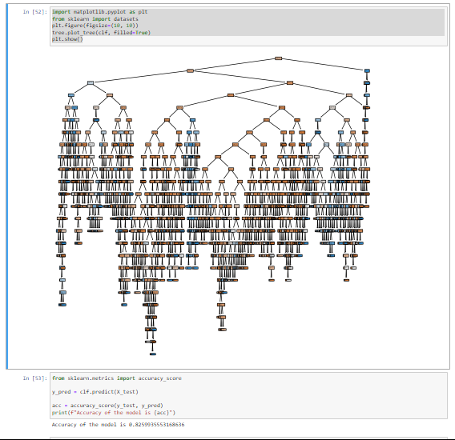

---

# 🌟 Employee Retention Prediction using Decision Tree Classifier 🌳

## 📝 Overview
This project implements a **Decision Tree Classifier** to predict whether an employee will leave the organization (`LeaveOrNot`) based on their attributes. The dataset is preprocessed using **Label Encoding**, and the model's performance is evaluated through a train-test split. The decision tree is visualized to understand the decision-making process. 🌟

---

## 📊 Dataset
The dataset (`Employee.csv`) includes the following columns:

| Column Name       | Description                                                                 |
|--------------------|-----------------------------------------------------------------------------|
| 🎓 `Education`        | Educational level of the employee.                                         |
| 📅 `JoiningYear`      | Year the employee joined the organization.                                 |
| 🏙️ `City`             | Location where the employee is based.                                      |
| ⚧ `Gender`           | Gender of the employee.                                                   |
| 🛋️ `EverBenched`      | Indicates whether the employee was ever benched (not assigned work).       |
| 🚪 `LeaveOrNot`       | Target variable: 1 if the employee left the organization, 0 otherwise.     |

---

## 🔧 Steps Followed
### 1. **Data Preprocessing**
- 🏷️ **Categorical Encoding**: Handled categorical variables (`Education`, `City`, `Gender`, `EverBenched`) using **Label Encoding**.
- 🔍 **Data Validation**: Verified for missing values and ensured data integrity.
- 🎯 **Feature-Target Split**: Separated the dataset into features (`inputs`) and the target variable (`LeaveOrNot`).

### 2. **Train-Test Split**
- ✂️ Used `train_test_split` to divide the data into **80% training** and **20% testing** sets.

### 3. **Model Building**
- 🌲 Built a **Decision Tree Classifier** using the `scikit-learn` library.
- 📏 Used the "entropy" criterion to calculate **information gain**.

### 4. **Visualization**
- 🖼️ Visualized the Decision Tree using `matplotlib` and `plot_tree` from `scikit-learn`.

### 5. **Model Evaluation**
- 📈 Predicted the target variable on the test dataset.
- 🎯 Calculated **accuracy** using `accuracy_score`.
- 📝 Generated a **classification report** and **confusion matrix** for detailed performance insights.

---

## 📊 Model Results
### 🔑 Accuracy
The model achieved an accuracy of **82.5%** on the test dataset. ✅

### 🌳 Decision Tree Diagram
The decision tree is visualized to understand the factors influencing employee retention decisions. Below is the decision tree diagram:



Alternatively, you can explore the file in the repository for a closer look. 👀

---

## ⚙️ Installation and Usage
### 📋 Prerequisites
Ensure the following are installed on your system:
- 🐍 Python 3.x
- 📘 Jupyter Notebook
- 📦 Required Python Libraries: `pandas`, `scikit-learn`, `matplotlib`

### 🚀 Steps to Run
1. Clone the repository:
   ```bash
   git clone https://github.com/Bushra-Butt-17/Employee-Retention-Prediction-using-Decision-Tree-Classifier.git
   cd Employee-Retention-Prediction-using-Decision-Tree-Classifier
   ```
2. Install dependencies:
   ```bash
   pip install pandas scikit-learn matplotlib
   ```
3. Open the Jupyter Notebook:
   ```bash
   jupyter notebook DecisionTreeEmployee.ipynb
   ```
4. Run the notebook cells sequentially to:
   - Preprocess the data 🧹
   - Train the model 🧠
   - Evaluate its performance 📊

---

## 📂 File Structure
```
Employee-Retention-Prediction-using-Decision-Tree-Classifier/
│
├── Employee.csv                 # Dataset 📄
├── DecisionTreeEmployee.ipynb   # Jupyter Notebook 📒
├── DecisionTreeDiagram.png      # Decision Tree Diagram 🌳
└── README.md                    # Detailed Project Description 📝
```

---

## 📦 Dependencies
The following Python libraries are used in this project:
- **pandas**: For data manipulation and preprocessing 📊
- **scikit-learn**: For implementing the Decision Tree Classifier and evaluation metrics 🌲
- **matplotlib**: For visualizing the decision tree 🎨

Install them using:
```bash
pip install pandas scikit-learn matplotlib
```

---

## 🔮 Future Work
- ⚙️ Add **hyperparameter tuning** for the Decision Tree Classifier.
- 🌳 Explore other algorithms like **Random Forest** and **Gradient Boosted Trees**.
- 📊 Perform **feature importance analysis** to identify the most critical factors affecting retention.

---

## 🌟 Let's Predict Employee Retention Efficiently!

This project provides insights into employee retention trends using machine learning techniques. Feel free to fork, experiment, and enhance the project. 🤝

---
